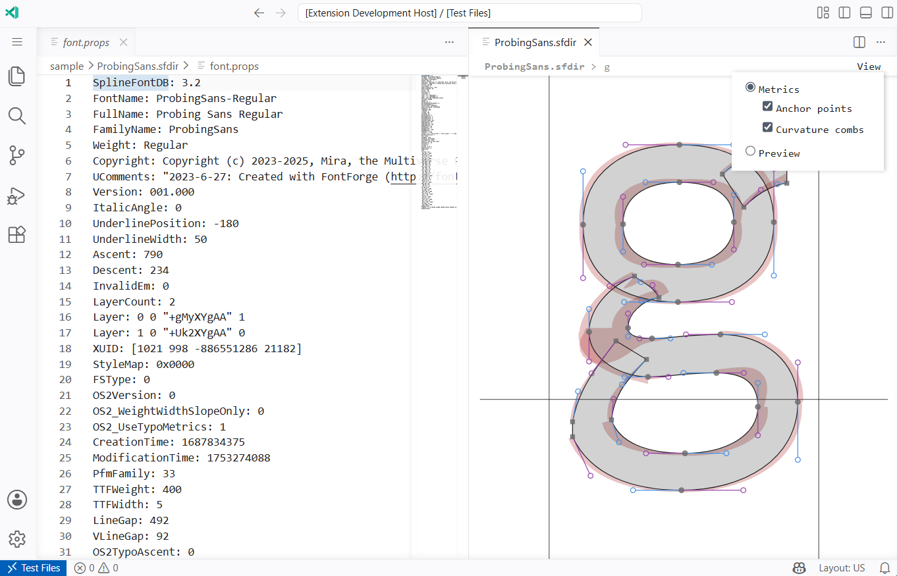

# FontForge Glyph Preview

This VS Code extension provides a preview feature for glyph images contained in Spline Font Database files (*.sdf, *.glyph, font.props) used by FontForge.

## Features

## Usage

1. Open a .sfd or .glyph or font.props file in VS Code.
2. Click the preview button at the top of the editor, or run "FontForge Glyph Preview: Open Preview (to the Side)" from the command palette (Ctrl+Shift+P).
3. The glyph image preview will appear in a side panel.

**Enjoy!**
